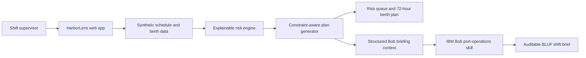

# Architecture

| Component | Technology | Responsibility |
| --- | --- | --- |
| Dashboard | HTML, CSS, vanilla JavaScript | Displays queue, plan, and scenario controls |
| Risk engine | `src/frontend/app.js` | Deterministic weighted risk calculation and reason labels |
| Plan generator | `src/frontend/app.js` | Sorts compatible vessels into feasible berth slots |
| Bob skill | Markdown prompt pack | Guides IBM Bob's codebase investigation and briefing |
| Development server | Python standard library | Serves the static application locally and exposes `/health` |

## Data flow

The browser loads a synthetic operational snapshot. When a scenario changes, the client recomputes vessel risk and schedule recommendations locally. The same computed objects supply the visual dashboard and bounded briefing text, preventing mismatch between a narrative and the displayed plan.

## Security and scale notes

This demo sends no data off-device. A production adapter should authenticate data-feed access, keep an audit trail of scenario assumptions and human approvals, validate inbound feed schemas, and enforce role-based access. For larger terminals, replace the heuristic with a server-side optimizer and persist versioned plans.
